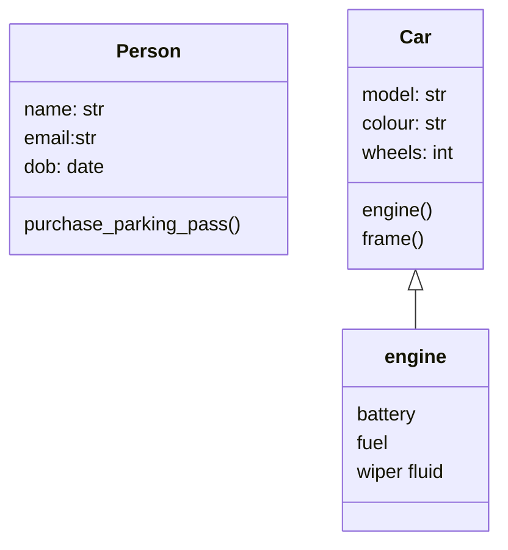

# Diagrams

## planning is important

draw.io or figma are good
an object is an instense of a class
class diagram methods
object diagram has the data

```mermaid
classDiagram

class Person {
    name: str
    email:str
    dob: date
purchase_parking_pass()
}


class Car{
    model: str
    colour: str
    wheels: int
engine()
frame()
}
class engine{
    battery
    fuel
    wiper fluid
}

Car <|-- engine
```